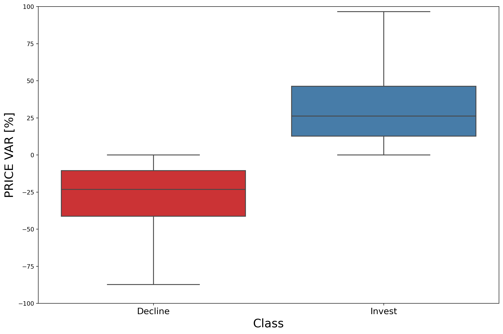
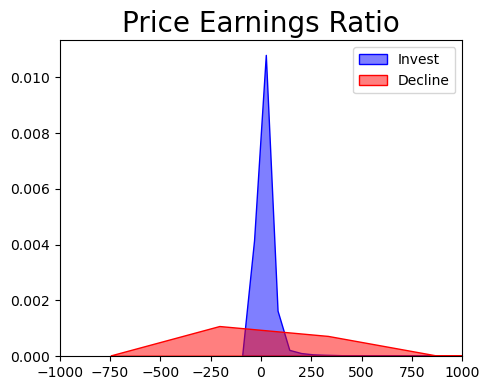
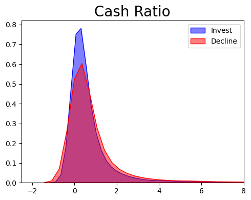
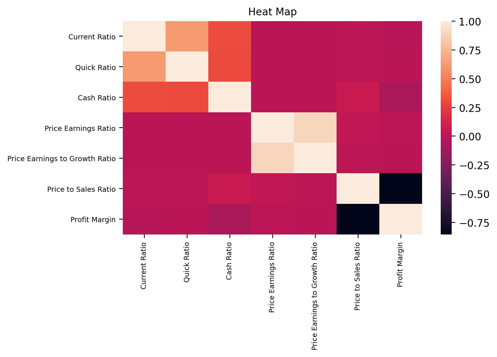
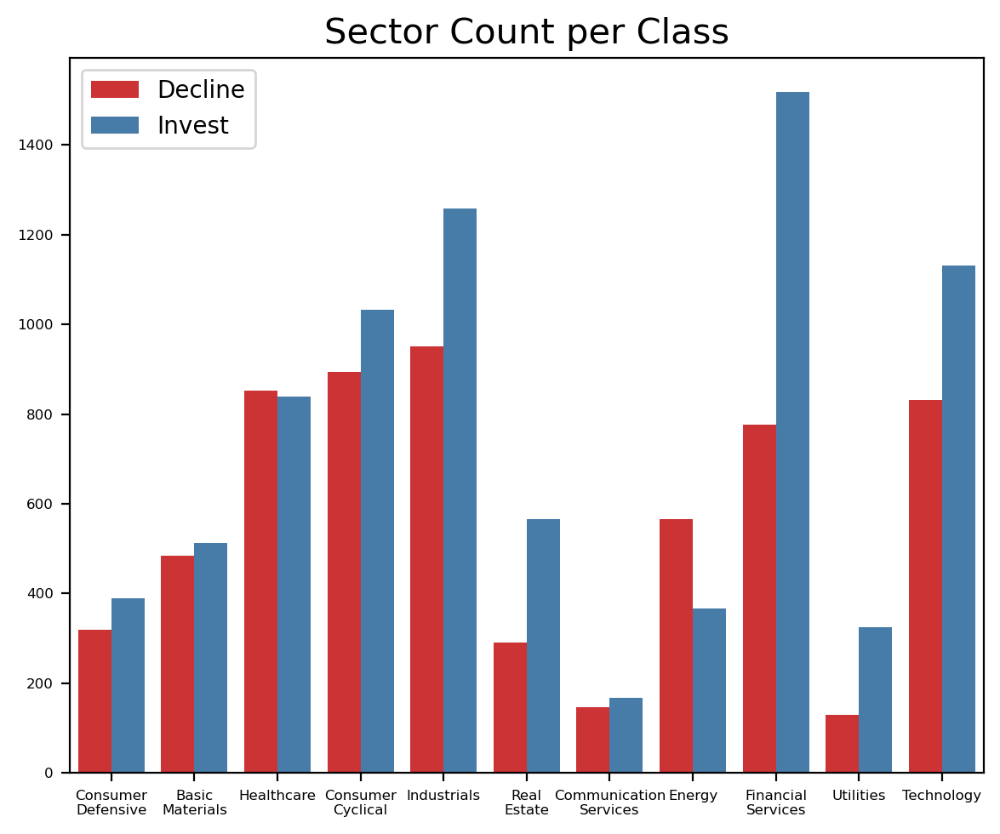
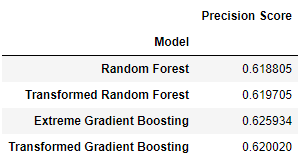
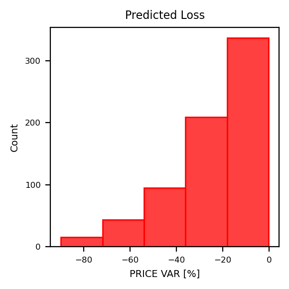
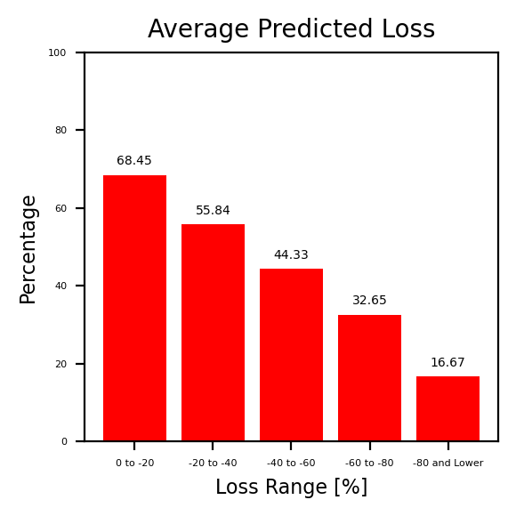
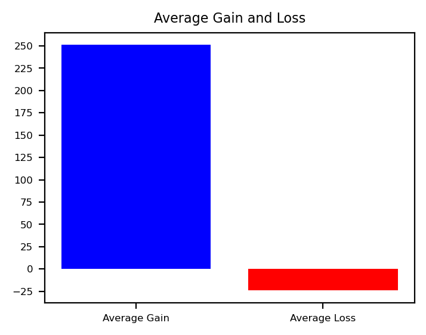

# Investment Decision with Annual Financial Statements

## The Stock Market

The stock market is where a person or entity can buy and sell publicly held companies' stocks.  The stock market is very volatile and many factors, such as interest rate, unemploymet, inflation, etc.  Though investing in the stock market has become more accessible with apps such as Robinhood, figuring out a good stock to buy and sell for profit is not an easy task.  With this project I seek to build a machine learning model that will use information found in companies annual financial statement to predict whether the company's stock will be a good one year investment.

## 1. Data

The dataset used in this project was found in the [Kaggle](https://www.kaggle.com/cnic92/200-financial-indicators-of-us-stocks-20142018) website.  There are 5 different datasets that represents 5 different years worth of data ranging from 2014 to 2018.  The 2 main columns in the datasets are the price variance percentage, which indicates the percentage gain or loss through out that year, and the class column that indicates invest or decline (1 or 0) which is dictated by a positive or negative price variance percentage.

## 2. Methodology

As I have previously mentioned, the dataset consists mostly of information taken from publicly held companies' annual fanancial statement.  So before beginning the project, I had to take some things into consideration:

1. The model will only be able to predict whether a stock is worth buying at the beginning of the fiscal year, hold, and sell at the end of the fiscal year.

2. The class column indicates whether or not a stock is worth the investment, a 1 value means that it is and a 0 value indicates to decline that option.  

3. The features in the financial information may vary from company to company.  For example, a bigger company will have higher profits and may be able to acquire more debt.  Because of that, I felt more prudent to utilize features that takes some ratios from the financial statements to try and identify strengths and weaknesses between the companies.

## 3. Data Wrangling
[Data Wrangling Report](https://github.com/soccershowman/Springboard-Capstone/blob/master/Capstone%20Project%20-%20Data%20Wrangling.ipynb)

The data used in this project came from 5 different datasets which represented the 5 years spanning from 2014 to 2018.  The first step then was to merge the data together.  The only problem on that step was the "PRICE VAR [%]" column because it originally had the year in which it was taken, for example the 2014 dataset had a "2015 PRICE VAR [%]" column.  To solve this issue I created a new columns in each dataset named "Year" which contains the original year of the dataset (2014 dataset had an "Year" value of 2014 and so on) which helps keep the information of some stocks separated by the year it was originated.  Then I changed the price variance column title to just "PRICE VAR [%]" to keep the information under the same column for all the stocks regardless of the year.  After merging all the files together, I set both the "Year" and the "Stock" columns as the dataset index.

The next steps taken in the continuation of this project were to simply drop useless information, such as duplicate columns and stocks with a high amount of missing values.  After that it was time to select which features were going to make it to the final final to be used for the machine learning model.  To choose the features to be used in the machine learning model, here is what I took into cosideration along with their respective features:

* Profitability Ratios - The ability the company has to generate profit (revenues - cost).
  * Return on Assets (ROA) - Measures a company ability to generate income from its assets.
  * Return on Equity (ROE) - Measure the profitability of a corporation in relation to stockholders' equity.
  * Profit Margin - Indicates how many cents of profit has been generated for each dollar of sale.

* Liquidity Ratios - The ability to meet short-term debt obligations without raising additional capital.
  * Current Ratio - Measures a company's ability to pay short-term obligations or those due within one year.
  * Quick Ratio - Indicates a company's capacity to pay its current liabilities without needing to sell its inventory or get additional financing.
  * Cash Ratio - Indicates a company's ability to repay its short-term debt with cash or near-cash resources, such as easily marketable securities.

* Coverage Ratios - Indicates the amount of debt a company incurs in relation to its equity and assets.
  * Debt Ratio - Measures the extent of a company’s leverage.  It can be interpreted as the proportion of a company’s assets that are financed by debt.
  * Debt to Equity Ratio - Indicates the degree to which its operations are funded by debt and whether shareholders’ equity can cover total liabilities.
  * Interest Coverage Ratio - Determine how easily a company can pay its interest expenses on outstanding debt.
  * Cash Flow to Debt Ratio - Dertermine how lond it would take a company to repay its debt if it devoted all of its cash flow to debt repayment.

* Sector - Sector in which the company provides goods or services.

The only "non-feature" columns that will be in the final datasets are:

* Price Variance Percentage - Indicates the percentage gains or loss of the companies stock throughout that year.
* Class - Indicates the recommendation whether to invest (1) or decline (0) the stock.  It is dictated by the price variance as shown in the figure below.

Some of the features were already existing in the main dataset, but most needed to be derived algebraically from the financial information of each company.

## 4. Exploratory Data Analysis

[Exploratory Data Analysis Report](https://github.com/soccershowman/Springboard-Capstone/blob/master/Capstone%20Project%20-%20Exploratory%20Data%20Analysis.ipynb)

The first step I took in this phase of the project was to check the data distribution of each feature.  It was by doing this that I found that I had some features with either a max value of positive infinity or a min value of negative infinity.  For the most part I was able to simply drop the stocks that contained those values in at least one of the features.  The issue though was with the "Cash Flow to Debt Ratio" which had a total of 2,749 stocks that contained infinity values.  Since what was causing the infinity values was the fact that those stocks indicated having a 0 (zero) value for their total debt, I made the decision to eliminate them because a company that has 0 total debt is a company that most likely is not investing in increased operations, which may cause them to be more affected by market volatility.

Once I took care of those stocks, I checked the distribution of each feature.  For the most part the features had a clear difference in the standard deviation, as shown in the image below.

Two of the features that did not present clear differences in the mean or standard deviation, such as the cash ratio feature (shown in the graph below), were proven to have different means with a permutation test.

The sole feature that I was not able to prove to have difference statistical values between the classes was the debt ratio feature.  That does not mean I will take it from the dataset.  Instead it serves for me to know which features to expect having less of an impact in the creation of the model.

A heatmap was also created to see which features could be considered redundancies.  fortunatelly not many were found and those that were, for the most part, did not have a strong correlation.  The only exceptions are the price earning to growth ratio and the price sales ratio, with a fairly high correlation, and the price to sales ratio and the profit margin, with an almost fully inverse relationship.

The sector feature was the only non numeric feature in the dataset.  To analyze its data I used a count chart that counted how many of each sector had decline class and how many had invest class.  This chart is as follows.

## 5. Machine Learning

[Machine Learning Report](https://github.com/soccershowman/Springboard-Capstone/blob/master/Capstone%20Project%20-%20Machine%20Learning.ipynb)

The classifiers I decided to use were the Random Forest Classifier and the Extreme Gradient Boosting Classifier.  I decided to use those because they work somewhat similarly, with the main difference being that the Extreme Boost Classifier combines the results as it goes, "learning" from past mistakes, while the Random Forest Classifier combines the results at the end.  To create the model I have also created a new set of datasets, with the second set having a PowerTransformed version of the numerical features of the original indicators dataset.  The reason to have this transformed dataset was to try and provide the model a dataset that would possibly have a relatively bigger difference between the means of the class in each feature.

The decision between which classifier and which dataset to use was made by measuring the precision score of each model.  The reason why I chose to highlight the precision score is because in order to get a high precision score, the model needs to produce less type I error, which would be predicting less false positives.  The reason I chose to focus on that is because I want to keep the percentage loss to as low as possible.  The best result was the Extreme Gradient Boosting model utilizing the regular data.  The results are as follows.

Because the winning model had a precision score of a bit over 0.62, which I considered a bit low, I used other methods to try and check its quality.  These methods were to check the concentration of the predicted losses, the percentage of losing stocks per loss range did the model predict, and comparing the average predicted loss with the average predicted gains.  The following graphics demonstrates those three key issues.

The model was able to concentrate the losses to closer to 0, the percentage of predicted loss gradually decreased as the price variance percentage went further into the negative values, and the mean gains far outweights the mean losses.

## Conclusion and Future Improvements

Though the model did not yield a high precision score, I consider the results to be very good.  The main reason why I believe the results were very good is because the model was able to keep losses low in the testing dataset.  That being said, this would be my future improvements for this project:

* I would shift the invest/decline line from the 0 to 10 or higher.  I believe that since the model was able to keep the losses low and maintain a very high average, it would be able to improve its precision score if it tries to simply predict higher than 0 price variation percentages.
* On the same note as the above bullet point, I would change the project from a classification predictor to a regression predictor.  With a regression predictor I would then analyse and set a bottom line as to the lowest predicted price variance percentage in which to invest.  I believe this would make it easier to try and predict stock by stock if the intention is not in investing in a collection of stocks all at once.

## Credits

I would like to thank Kaggle user Nicolas Carbone for making the datasets available on Kaggle, personal friend of mine Gene Perry for giving me some pointers on how to proceed with some domain knowledge and lastly but not least my Springboard mentor Branko Kovac for patiently guiding me throughout this project.
